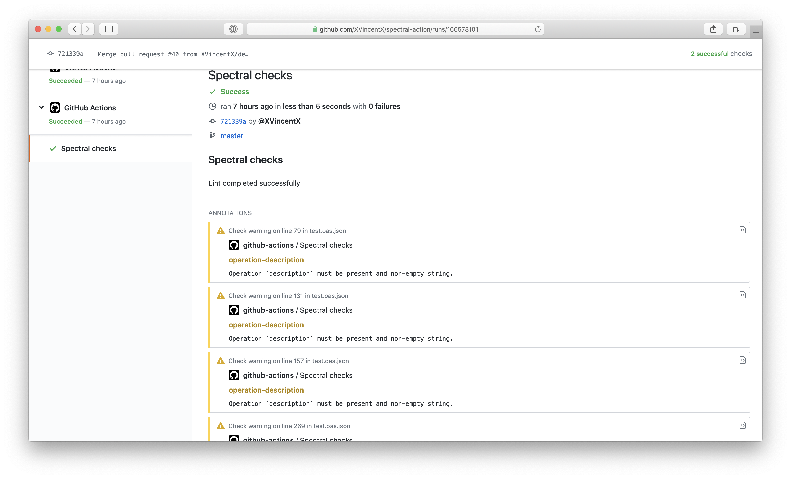

# Spectral Linter Action

This action uses [Spectral](https://github.com/stoplightio/spectral) from [Stoplight](https://stoplight.io/) to lint your OpenAPI documents, or any other JSON/YAML files.



## Usage

See [action.yml](action.yml)

```yaml
name: Run Spectral on Pull Requests

on:
  - pull_request

jobs:
  build:
    name: Run Spectral
    runs-on: ubuntu-latest
    steps:
      # Check out the repository
      - uses: actions/checkout@v3

      # Run Spectral
      - uses: stoplightio/spectral-action@latest
        with:
          file_glob: 'doc/api/*.yaml'
```

### Inputs

- **file_glob:** Pattern describing the set of files to lint. Defaults to `*.oas.{json,yml,yaml}`. (_Note:_ Pattern syntax is documented in the [fast-glob](https://www.npmjs.com/package/fast-glob) package documentation)
- **spectral_ruleset:** Custom ruleset to load in Spectral. When unspecified, will try to load the default `.spectral.yaml` ruleset if it exists.

## Configuration

Spectral Action will respect your [Spectral Rulesets](https://meta.stoplight.io/docs/spectral/01baf06bdd05a-rulesets), which can be defined, extended, and overriden by placing `.spectral.yml` in the root of your repository.

However, if you'd like to simply use a core ruleset without additional configuration, create a `.spectral.yml` in you repository's root with only the contents: `extends: ["spectral:{rulesetTagHere}"]`
